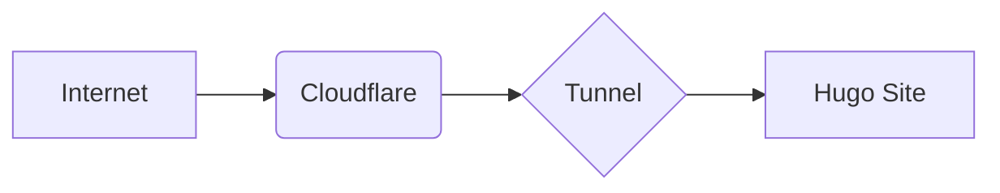

# Portfolio Infrastructure: Zero-Trust Web Deployment

**Status:** Operational  
**URL:** [https://portfolio.lovespluto.org](https://portfolio.lovespluto.org)

## Technical Summary
This project documents the end-to-end deployment of a hardened personal portfolio using **Proxmox**, **Debian 12**, and **Cloudflare Zero Trust**. By implementing an outbound-only tunnel, the infrastructure maintains a "stealth" network profile with **zero open ingress ports**, effectively mitigating external scanning and unauthorized access.

## Core Objectives
* **Virtualization:** Deploy and manage a Debian 12 LXC on Proxmox VE.
* **Web Architecture:** Configure Hugo (Blowfish theme) with Extended binary support for SCSS.
* **Identity & Access:** Provision a persistent Cloudflare Tunnel as a managed systemd service.
* **DevOps:** Establish a secure "Source of Truth" on GitHub using token-based authentication.

## Tech Stack
* **Hypervisor:** Proxmox VE
* **OS:** Debian 12 (LXC)
* **SSG:** Hugo (v0.143.1+extended)
* **Networking:** Cloudflare Tunnel (Argo)
* **Service Mgmt:** systemd

---

## Technical Audit Trail

### Architecture & Service Isolation
* **Decision:** Deployed a dedicated `cloudflared` instance within the Portfolio CT to ensure micro-service isolation.
* **Networking:** Utilized DHCP reservations on an Asus router to bind MAC addresses to static internal IPs, ensuring service persistence.

### Infrastructure Challenges
* **Dependency Resolution:** Resolved Hugo version incompatibility by purging `apt` packages and manually installing the Extended binary to support Blowfish theme requirements.
* **Shell Pathing:** Debugged `No such file or directory` errors post-installation by executing `hash -r` to refresh the bash command cache.
* **Network Binding:** Resolved `ERR_CONNECTION_REFUSED` by overriding Hugo's default loopback binding with `--bind 0.0.0.0` for LAN accessibility.
* **API Conflicts:** Resolved `Create Tunnel API call failed` by purging orphaned cloud records via `cloudflared tunnel delete` and re-initializing with explicit credential pathing.

### Security & Hardening
* **Credential Isolation:** Migrated `config.yml` and JSON credentials from user-space to `/etc/cloudflared/` for secure system-level execution.
* **Version Control:** Implemented strict `.gitignore` rules to prevent infrastructure UUIDs and private keys from leaking to public repositories.
* **Authentication:** Transitioned from password-based login to Personal Access Tokens (PAT) with restricted `repo` scopes.

### Final Service Verification & Persistence
To ensure high availability and zero-trust ingress, both the network tunnel and the web server are managed as persistent `systemd` services.

* **Service Health:** Verified via `systemctl status cloudflared` and `systemctl status hugo` to ensure a 100% uptime baseline.
* **Pathing:** Successfully routed `portfolio.lovespluto.org` to `localhost:1313` with a 404 security catch-all and FQDN sanitization.

---

> [!NOTE]
> **Project Maintenance Policy**
> While the interface and content of this portfolio undergo continuous iteration, these logs serve as a permanent technical audit trail. Only significant infrastructure migrations or security hardening measures will be formally documented here to maintain a high signal-to-noise ratio for review.
